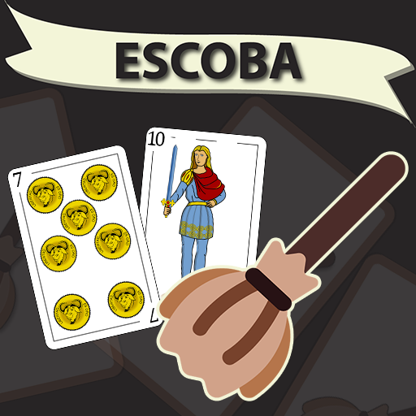
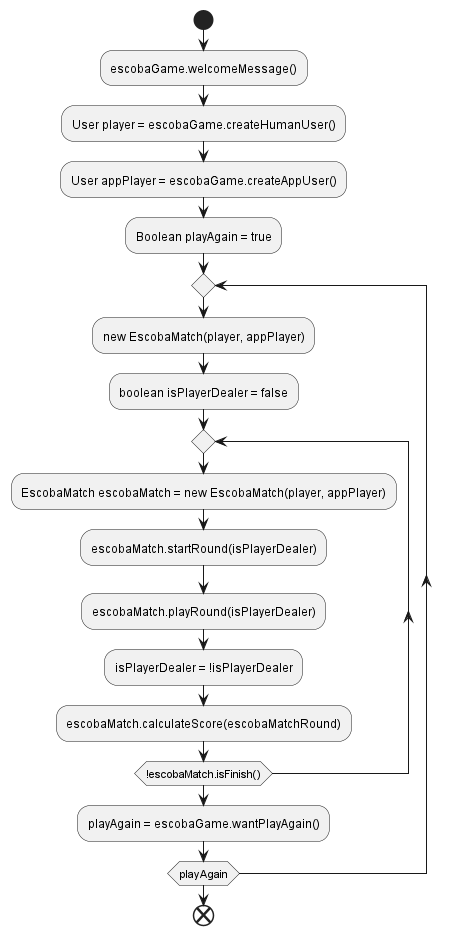

  

# Examen - "La escoba de 15"

Se pide construir una aplicación de consolas en Java que permita a una persona 
jugar al tradicional juego de cartas “La Escoba de 15". El juego de la Escoba
es un juego de cartas en el que dos o mas jugadores deben sumar 15 puntos para 
ganar la partida. Existen diferentes formas de sumar los puntos.

## Descripción del juego

El juego se juega con una baraja española de 40 cartas.
El objetivo principal de la Escoba es obtener la mayor cantidad de puntos 
"barriendo" cartas de la mesa haciendo grupos de cartas que sumen 
15 puntos, teniendo en cuenta que cada una de ellas tiene el valor del número 
que representa, a excepción de la sota que vale 8, el caballo que vale 9 y el 
rey que vale 10.

| Carta        | Valor |
|--------------|-------|
| 1            | 1     |
| 2            | 2     |
| 3            | 3     |
| 4            | 4     |
| 5            | 5     |
| 6            | 6     |
| 7            | 7     |
| 10 (sota)    | 8     |
| 11 (caballo) | 9     |
| 12 (rey)     | 10    |

## Dimanica del juego

Cada jugador recibe 3 cartas al inicio del juego y se colocan 4 cartas en la mesa. 
El jugador que tiene el turno debe seleccionar una carta de su mano y tratar de
sumar 15 puntos incluyendo cartas de la mesa. Si lo logra, se lleva las cartas que componen la suma
a su montón de cartas. Si no lo logra, debe colocar una carta en la mesa y pasar el turno 
al siguiente jugador. De esta forma se sigue jugando hasta que se acaben las cartas de la baraja.
Al terminar la ronda de manos, se cuentan los puntos de cada jugador, si ninguno logró sumar 15 puntos totales,
los mismos se registran y se juega otra ronda. El juego termina cuando un jugador llega a 15 puntos.

## Reglas del juego

### Escoba

Si consigue sumar 15 puntos usando todas las cartas de la mesa se dice que ha hecho una escoba.

### Escoba en mesa

Cuando se reparten las cartas al inicio del juego y se encuentra que las cuatro que ha descubierto sobre 
la mesa suma 15 puntos, quien reparte tiene derecho a reclamar la escoba.

### Cartas sobrantes al final de la mano (No se requiere implementación)

Cuando todos los jugadores hayan jugado sus cartas y no queden más para repartir, 
habrán quedado sobre la mesa una o varias cartas con las que es imposible sumar 15. 
Las mismas serán recogidas por el jugador que recogió cartas por última vez.

### Recuento de puntos

* Un punto por escoba.
* Un punto para quien tenga el 7 de oros, también llamado "el velo".
* Un punto más el que consiga el mayor número de cartas con valor 7, (en caso de empate no sumaria nadie este punto)
* Un punto para quien tenga el mayor número de cartas, (en caso de empate no sumaria nadie este punto).
* Un punto para quien tenga el mayor número de oros, (en caso de empate no sumaria nadie este punto).
* Un punto extra si un jugador consigue los 4 siete.
* Un punto extra si un jugador consigue todos los Oros.

### Fin del juego

Gana el jugador que en sucesivas rondas llega antes a conseguir los 15 puntos fijados al principio de la partida.

## Requisitos del sistema

1. La aplicación debe iniciar con un mensaje de bienvenida y pedir el nombre del jugador.
2. La partida siempre será de 2 jugadores, una persona jugando contrá la máquina.
3. El primero en repartír siempre será la máquina.
4. El programa debe permitir que el jugador juegue su turno, indicando una carta de su mano 
que usará para sumar 15 puntos.
5. Si el jugador no puede sumar 15 puntos, solo indicará una carta en su mano para jugar en la mesa.
6. La estrategia del jugador, estará obviamente definida por la habilidad del mismo para jugar este juego.
7. La estrategía de la máquina seguirá las siguientes reglas por orden de prioridad:
   * Priorizará siempre sumar 15 puntos usando todas las cartas de la mesa para hacer escobas.
   * Luego priorizará barrer de la mesa usando el 7 de Oros, ya sea que esté en la mesa o en su mano.
   * Luego priorizará barrer de la mesa cartas de Oro por sobre otros palos, 
     esta regla aplica tanto para cartas de la mesa como las que tiene en la mano.
   * Luego priorizará barrer de la mesa cartas de 7 por sobre otros números,
     esta regla aplica tanto para cartas de la mesa como las que tiene en la mano.
   * Luego priorizará barrer de la mesa cartas usando la mayor cantidad de cartas posibles.
   * Si no puede sumar 15 puntos, siempre que sea posible, priorizará descartar cartas de la mano 
     evitando usar el 7 de Oros, cualquier otra carta de oro y por último el resto de los siete.
8. El programa debe mostrar el estado actual del juego en cada turno, incluyendo las cartas de la mano 
   del jugador, las cartas de la mesa y las cartas que se han llevado a los montones con la cantidad de escobas.
9. Al final de cada mano, el programa debe mostrar el recuento de puntos de la mano y sus motivos 
   de suma con el total acumulado en la mano y en la partida.
10. Si al finalizar la mano hay un ganador, debe mostrar el nombre del jugador ganador y el total de puntos.

## Modo de evaluación

Como ya practicamos en clases, el código ya está empezado y restan completar algunas partes del mismo.
Cada parte del código a completar tiene un puntaje asignado, el cual se detalla a continuación.
El puntaje total del examen es de 100 puntos y se requieren al menos 60 puntos para aprobar.

| Clase | Método | Puntaje  |
|-------|--------|----------|
| [HumanRoundPlayer](./src/main/java/ar/edu/utn/frc/tup/lciii/round/HumanRoundPlayer.java) | getCardToPlay | 10       |
| [AppRoundPlayer](./src/main/java/ar/edu/utn/frc/tup/lciii/round/AppRoundPlayer.java) | selectCardsApp | 10       |
| [AppRoundPlayer](./src/main/java/ar/edu/utn/frc/tup/lciii/round/AppRoundPlayer.java) | getCardsWithSeven | 5        |
| [AppRoundPlayer](./src/main/java/ar/edu/utn/frc/tup/lciii/round/AppRoundPlayer.java) | getCardsWithEscoba | 5        |
| [AppRoundPlayer](./src/main/java/ar/edu/utn/frc/tup/lciii/round/AppRoundPlayer.java) | getCardsWithSevenOro | 5        |
| [AppRoundPlayer](./src/main/java/ar/edu/utn/frc/tup/lciii/round/AppRoundPlayer.java) | getCardsWithMoreOros | 5        |
| [EscobaMatchRound](./src/main/java/ar/edu/utn/frc/tup/lciii/round/EscobaMatchRound.java) | dealCards | 5        |
| [EscobaMatchRound](./src/main/java/ar/edu/utn/frc/tup/lciii/round/EscobaMatchRound.java) | solveSevenWinner | 5        |
| [EscobaMatchRound](./src/main/java/ar/edu/utn/frc/tup/lciii/round/EscobaMatchRound.java) | sevenOroCheck | 5        |
| [Deck](./src/main/java/ar/edu/utn/frc/tup/lciii/Deck.java) | createDeck | 5        |
| [EscobaMatch](./src/main/java/ar/edu/utn/frc/tup/lciii/EscobaMatch.java) | isFinish | 5        |
| [DeckTest](./src/test/java/ar/edu/utn/frc/tup/lciii/DeckTest.java) | createDeckTest | 5        |
| [DeckTest](./src/test/java/ar/edu/utn/frc/tup/lciii/DeckTest.java) | takeCardTest | 5        |
| [DeckTest](./src/test/java/ar/edu/utn/frc/tup/lciii/DeckTest.java) | isEmptyTest | 5        |
| [DeckTest](./src/test/java/ar/edu/utn/frc/tup/lciii/DeckTest.java) | shuffleDeckTest | 5        |
| [EscobaGameTest](./src/test/java/ar/edu/utn/frc/tup/lciii/EscobaGameTest.java) | getYesNoAnswerTest_YesAnswer | 5        |
| [EscobaGameTest](./src/test/java/ar/edu/utn/frc/tup/lciii/EscobaGameTest.java) | getYesNoAnswerTest_NoAnswer | 5        |
| [EscobaGameTest](./src/test/java/ar/edu/utn/frc/tup/lciii/EscobaGameTest.java) | getYesNoAnswerTest_NullAnswer | 5        |
| **Total** | | **100**  |

## Ayuda

### Video explicativo del juego

Si no sabe como jugar el juego, aquí se deja un video explicativo

https://www.youtube.com/watch?v=GobUrRse5vU

### Diagrama de flujo

El siguiente diagrama de flujo muestra la secuencia de pasos que debe seguir el programa para jugar.

Un juego, representado por la clase [EscobaGame](./src/main/java/ar/edu/utn/frc/tup/lciii/EscobaGame.java), 
se encarga de manejar el flujo del programa. El mismo puede ejecutar más de una 
partida [EscobaMatch](./src/main/java/ar/edu/utn/frc/tup/lciii/EscobaMatch.java), las que están compuestas
por una o mas rondas [EscobaMatchRound](./src/main/java/ar/edu/utn/frc/tup/lciii/round/EscobaMatchRound.java).
En cada ronda se juegan multiples manos hasta que se agota el mazo de cartas 
[Deck](./src/main/java/ar/edu/utn/frc/tup/lciii/Deck.java). 

El mazo de cartas usado en este juego es una baraja española de 40 
cartas [Card](./src/main/java/ar/edu/utn/frc/tup/lciii/Card.java). Cada carta tiene una 
figura [CardSuit](./src/main/java/ar/edu/utn/frc/tup/lciii/CardSuit.java), un número y un valor.

Los usuarios [User](./src/main/java/ar/edu/utn/frc/tup/lciii/User.java) pueden jugar multiples partidas, 
por lo tanto, pueden jugar multiples rondas. Para contener la información de cada usuario en cada ronda, 
se utiliza la clase [RoundPlayer](./src/main/java/ar/edu/utn/frc/tup/lciii/round/RoundPlayer.java).
La misma tiene una implementación para el jugador humano [HumanRoundPlayer](./src/main/java/ar/edu/utn/frc/tup/lciii/round/HumanRoundPlayer.java)
y otra para el jugador de la aplicación [AppRoundPlayer](./src/main/java/ar/edu/utn/frc/tup/lciii/round/AppRoundPlayer.java).
En este último se lleva el control del estado de las cartas que tienen los jugadores en la mano,
el montón de cartas que van barriendo, la cantidad de escobas y los puntos acumulados en la ronda cuando esta termina.

  

