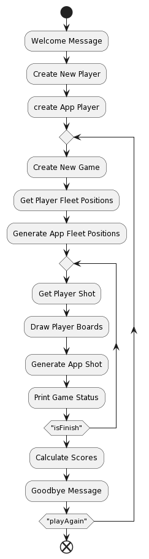

  

# Parcial 1 - "BATALLA NAVAL"

Se pide construir una aplicación de consolas en Java que permita a una 
persona jugar al tradicional juego de la “Batalla Naval". El juego de la 
Batalla Naval es un juego de estrategia en el que dos jugadores colocan 
barcos en un tablero y tratan de adivinar la ubicación de los barcos del 
oponente para hundirlos. La aplicación debe cumplir con los siguientes 
requisitos:

1. La aplicación debe iniciar con un mensaje de bienvenida y pedir el nombre del jugador. 
2. El programa debe permitir que el jugador coloque sus barcos en un tablero de 10x10, debe especificar la posición de 20 barcos, cada uno ocupa una casilla únicamente. 
3. La computadora debe colocar sus barcos en un tablero de forma aleatoria. 
4. El programa debe permitir al jugador disparar contra el tablero de la computadora especificando una coordenada. 
5. La computadora debe disparar contra el tablero del jugador de forma aleatoria sin repetir disparos anteriores (sin usar coordenadas ya usadas). 
6. El programa debe mostrar el estado actual del juego en cada turno, incluyendo el tablero con los barcos del jugador y el tablero de la computadora con los disparos realizados por el jugador, sin mostrar la posición de los barcos de la computadora. 
7. En cada jugada el programa debe mostrar la cantidad de barcos restantes para cada jugador y verificar si alguno de los jugadores ha ganado el juego. 
8. El programa debe determinar cuándo un jugador ha hundido todos los barcos del oponente y declararlo como ganador. 
9. El programa debe permitir al jugador salir del juego en cualquier momento. 
10. Cada partida otorga 20 puntos al ganador y al perdedor 1 punto por barco hundido. 
11. La aplicación debe llevar un registro de cuantas partidas ganó cada jugador durante una misma ejecución de la aplicación y su puntaje. 
12. Si el jugador decide no volver a jugar, debe mostrar quién ganó más puntos.

La aplicación debe estar construida utilizando Java y debe utilizar un 
enfoque modular. La lógica del juego debe estar separada de la lógica de 
presentación. Se deben escribir Test que validen la solución implementada 
(Al menos se deben desarrollar los Test de un método público y uno privado, 
contemplando sus límites)

## Ayuda

Si no sabe como jugar el juego, aquí se deja un video explicativo

https://www.youtube.com/watch?v=M2rks6jJ8mE

## Diaghrama de flujo

  

